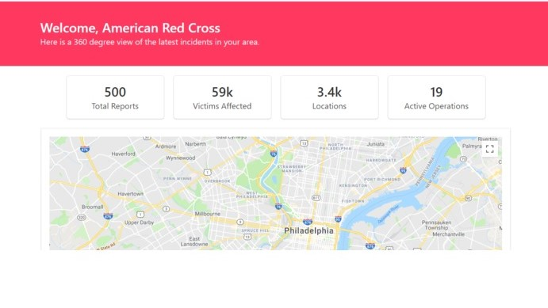

# MESS
A modernized emergency services system to assist relief organizations and local governments in responding faster and appropriately.

## What it does
MESS is a cross between next-generation 911 and disaster response management. The primary users are local governments and relief organizations. The platform provides organizations and governments with the crucial information that is required for response, relief, and recovery by organizing and leveraging incoming disaster related data.

## How was it built
MESS was built using React for the web dashboard and a Flask service housing the image classification and natural language processing models to process the incoming mobile data.

## What's next
I'd like to expand our platform for medical data, local transportation delays, local river level changes, and many more ideas. I was able to build a fraction of our ideas this weekend, but we hope to build additional features in the future.

## Contents
* __MESS-Service__ is the Flask backend for the React Dashboard
* __MESS-Platform__ is the Gatsby project

## Tools used:
- React
- Flask
- Google maps
- NLP
- Image Classification
- Twlilio
- Wit.ai
- Google Vision
